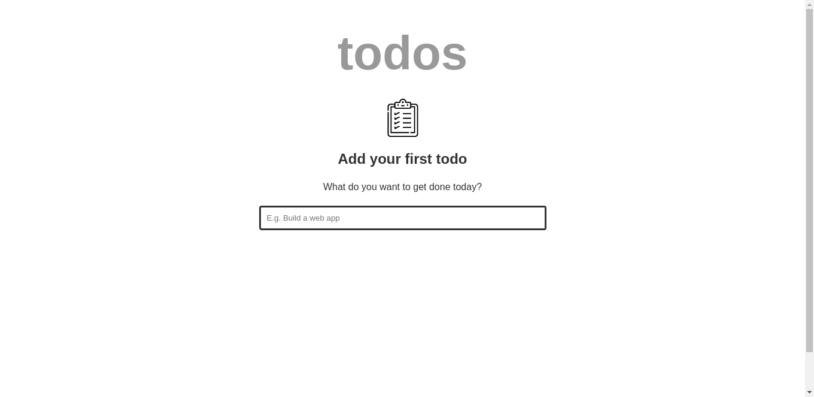

# Svelte 3 Todo List App starter files

Starter files for the Todo List app built with Svelte 3. [Tutorial](https://freshman.tech/svelte-todo/)

[Here's a live demo of the completed application](http://svelte3-todo.surge.sh/).

The code in this repo is meant to be a reference point for anyone following along with the tutorial.

## Prerequisites

You need to have **Node.js** and **npm** installed on your computer.

## Getting started

[Clone](https://github.com/freshman-tech/svelte-todo-starter-files) this repository to your filesystem.

<!-- `cd` into the project directory and follow along with the [tutorial](https://freshman.tech/svelte-todo/). -->
### Anatomy of a Svelte components

Svelte Components are composed in `.svelte` files. This is where all the markup, logic and styling for a  particular component will be writted in.

### Create the Application Structure

Open up `App.svelte` and replace the **<!-- component markup -->** comment with the following [code](src/App.svelte#L-L44). Just Basic HTML that describes the structure of our application. For simplicity, the styles for the app are placed in``public/global.css` while the svg icons used are defined in `public/index.html`.

Next, let's figure out how to add a todo item and render it in the application.

### Add a todo

Add the [code](./scrc/App.svelte#L1-L18) between the `script` tags in the `App.svelte`.

The `todoItems` array serves to hold our todo list items while `newTodo` represents the input of the the user when adding a new todo item. When the `addTodo` function is invoked, a mew `todo` object is constructed and appended to the `todoItems`array. The reason why the spread operator to construct a new array nstead of using `todoItems.push(todo)` for example is because [Svelte only updates the DOM on assignments](https://svelte.dev/tutorial/updating-arrays-and-objects).

Binding our markup to the logic -> By ,updating the `form` elment in the [HTML](./src/App.svelte#L35-L42).

Svelte provides a handy way to bind functions to events using the `on:event` syntax while passing in a reference to a function defined in your JavaScript logic. DOM event handlers can have modifiers that can alter their behavior. For example, when handling a form submission on the client, you typically want to do `event.preventDefault()` to stop the browser from refreshing the page. Svelte provides a `preventDefault` modifier that does this for you before running your event handler. That’s what the `|preventDefault` part after on:submit is all about.

If you look at the `<input>` element, you will see a new `bind:value` attribute and the `newTodo` variable passed to it. This how two-way binding is achieved in Svelte. If you’re not familiar with this concept, it helps us update the `newTodo` variable with the value of the form input and also update the form input if the `newTodo` variable is updated programatically in the app logic. This is why setting newTodo to an empty string at the end of the `addTodo` function clears the form input.

Try it out. Enter a new todo item, and hit **enter**. Behind the scenes, the todo item will be appended the `todoItems` array, and the form input is cleared. If you want to see this in action, log `todoItems` to the console at the end of `addTodo()`.

### Render the todo items

Once we append a new todo to `todoItems`, we  want the page to be updated and the item rendered on the screen. We can do this easily in Svelte using a special `each` construct in the [HTML](./src/App.svelte#L27-L38):

For each todo in the `todoItems`, the `li` element is appended he DOM. If you're coming from React or Vue, it's essential to add a `key` to each item when rendering a list. In Svelte, you can do this using the `(key)` synta in `each` construct. This helps Svelte figure out what items are changed, added or removed in an efficient manner. In this instance, use todo's `id` as the key. 

### Mark todo items as completed

Next, we need a way to indicate that a todo item has been completed. That's what the `checked` property on the `todo` object is for. When a todo item is done, this property need to be toggled to `true` and vide versa. Add a new [`toggleDone`](./src/App.svelte#L18-L21) function below `addTodo`

Then update the `li` element in the `each` [block as follows:](./src/App.svelte#L42-51)

_Note:_ You need to place your handler in an arrow function when you want to pass argument to the function. If you do `on:click={toggleDone}` instead, the DOM event is what will be passed into the function.

Once the `checked` property on a todo is set to `true`, the `done` class is to toggled on the `li` element. This has the effect of showing a checkmark in the checkbox of the item and striking out the text.

### Delete a todo item

Removing an item from the list is easy enough. Add a new [`deleteTodo` function](./src/App.svelte#L) below `toggleDone`:

Then bind it tot the `button` inside the `li` element.

That's it! Clicking the `x` button will now remove the item from `todoItems` while Svelte take care of the DOM update. 

### Keep for focus on the form input

At the moment, onjce a new todo item is submitted the input goes out of focus and has to be refocused manually each time you want to add another todo. This can become quite tedious if you want to add a large amount of items. To keep focus of the input, we can hook into the `afterUpdate` lifecycle hook which turn runs after the DOM updated.

Import `afterUpdate` at the top of the `<script>` tag in the `App.svelte` and use it.

## Conclusion
This project helps in learning Svelte and how you can use it to build user interfaces.
